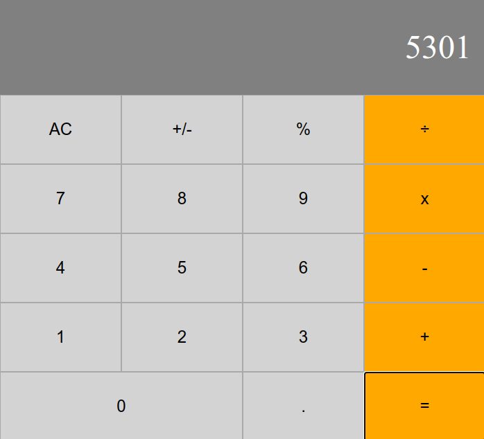

# Calculator App

> A Calculator web application built on React library.

## Table of Contents

- [Features](#features)
- [Built With](#built-with)
- [Live Demo](#live-demo)
- [Getting Started](#getting-started)
  - [Installation](#installation)
  - [Usage](#usage)
- [Author](#author)

## Features

- Allows users to calculate the basic mathematical operations.

## Screenshot



## Built With

- Node.js
- React
- React-DOM
- React-Create-App
- npm
- SASS
- ES6
- Heroku

## Live Demo

[Live Demo Link](https://https://rna-calculator.herokuapp.com/)

## Getting Started

To get a local copy up and running, follow these simple example steps.

<!-- ### Prerequisites -->

<!-- ### Setup -->

### Installation

Clone the repo with:

```sh
git clone https://github.com/rna/calculator
```

### Usage

1. Run `npm install` to install all dependencies

2. Run `npm start` to start the local server

<!-- ## Roadmap -->

<!-- ### Deployment -->

### Author

👤 **Ramesh Naidu Allu**

- Github: [@rna](https://github.com/rna)
- Twitter: [@rnadev](https://twitter.com/rnadev)
- Linkedin: [Linkedin](https://linkedin.com/in/ramesh-naidu)

## 🤝 Contributing

Contributions, issues and feature requests are welcome!

Feel free to check the [issues page](issues/).

## Show your support

Give a ⭐️ if you like this project!

## Acknowledgments

[create-react-app-buildpack](https://github.com/mars/create-react-app-buildpack)

## 📝 License

This project is [MIT](lic.url) licensed.
